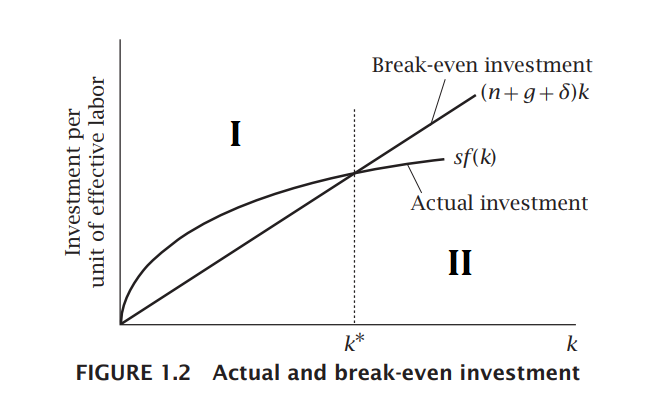
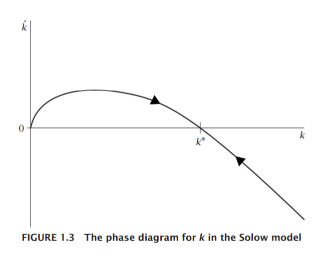

### Equação central do modelo de Solow

$$
\dot{k}(t) = s\cdot f\big( k(t) \big) - (n+g+\delta)\cdot k(t)
$$

- $s \cdot f\big( k(t) \big)$ denota o investimento efetivo, sendo $f(\cdot)$ a função de produção na forma intensiva.
- $(n+g+\delta)$ denota a depreciação na forma intensiva.
  1. $\dot k(t) > 0$, investimento $>$ depreciação.
  2. $\dot k(t) = 0$, investimento $=$ depreciação.
  3. $\dot k(t) < 0$, investimento $<$ depreciação.

**Representação gráfica**

<figure>
	

    	
		<figcaption>Fonte: Adaptado de Romer (2012)</figcaption>
    

</figure>

Situação **I**: investimento $>$ depreciação.

Situação **II**: investimento $<$ depreciação.

$k^{*}$: estado estacionário (EE).

Dadas as hipóteses do modelo:

1. existe um único ponto de equilíbrio $\big(k^{*}, f(k^{*})\big)$;
2. nesse estado estacionário, o estoque de capital é constante (equilíbrio estável);
3. a economia caminha em direção ao estado estacionário.

<u>Olhando para $K$</u>: no EE, qual é a taxa de crescimento do estoque de capital?

- Há uma taxa de crescimento que é dada pela depreciação. O estoque de capital fica constante se crescer na mesma taxa em que se deprecia.

- Para $AL$ (trabalho efetivo), a taxa de crescimento será dada pela soma dos termos $(n+g)$.

  - A taxa de crescimento $(n+g)$ também será aplicável para a taxa de crescimento de $K$.

    - Como $k = \displaystyle\frac{K}{AL} \Rightarrow k^{*}\ \text{cte.}$, então $K$ e $AL$ devem crescer à mesma taxa.
      $$
      k^{*} = \displaystyle\frac{K}{AL} \Leftrightarrow K = k^{*}AL
      \Rightarrow \ln K = \ln k^{*} + \ln (AL) \\
      
      \begin{align}
      \therefore \displaystyle\frac{d}{dt}\big(\ln K\big) = &\ \frac{d}{dt}\big(\ln k^{*}\big) + \frac{d}{dt}\big(\ln (AL) \big) \\
      \frac{\dot K}{K} = &\ \frac{1}{k^{*}} \cdot 0 + \frac{1}{AL} \big( \dot A L + A \dot L \big) \\
      \frac{\dot K}{K} = & \ \frac{\dot A}{A} + \frac{\dot L}{L} \Rightarrow \dot K = (n+g)K
      \end{align}
      $$
      

**Diagrama de fases**:

<figure>
    

        
        <figcaption>Fonte: Adaptado de Romer (2012).</figcaption>
    

</figure>

<u>Crescimento balanceado</u>:

- Se a função de produção tem retornos constantes de escala, e suas variáveis estão crescendo a uma taxa $(n+g)$, significa que o produto $Y$ também cresce a uma taxa $(n+g)$.

- Se o capital e o produto estão crescendo na mesma velocidade, a sua relação é constante.

  - Relação capital-produto $\displaystyle\frac{K}{Y}$ é constante.

    > Não há progresso técnico de ponto de vista do capital (produtividade do capital é constante), o que decorre do pressuposto do modelo: $A \cdot L$.

    - Decorre também da homogeneidade da função de produção:
      $$
      cY = f(cK, cAL) = c f(K,AL) \Rightarrow \displaystyle\frac{K}{Y}\ \text{cte.}
      $$
      

  - E o produto e o capital per capita?
    $$
    k^{*} = \displaystyle\frac{K}{AL} \Leftrightarrow K = k^{*} AL \ \ (\div L) \Rightarrow \frac{K}{L} = k^{*}A\\
    \Rightarrow \ln \bigg(\frac{K}{L}\bigg) = \ln k^{*} + \ln A \\
    
    \begin{align}
    \therefore \displaystyle\frac{d}{dt}\Bigg[\ln \bigg(\frac{K}{L}\bigg)\Bigg] = &\  \frac{d}{dt}\big(\ln k^{*}\big) + \frac{d}{dt}\big(\ln A\big) \\
    \bigg(\frac{K}{L}\bigg)^{-1} \frac{d}{dt}\bigg(\frac{K}{L}\bigg) = &\ \frac{1}{k^{*}} \cdot 0 + \frac{\dot A}{A} \\
    \frac{d}{dt}\bigg(\frac{K}{L}\bigg)\bigg/\frac{K}{L} = &\ g
    \end{align}
    $$
    

**Variação na taxa de poupança**:

Suponhamos um aumento permanente em $s$: choque de poupança.

- $\uparrow s$ (por exemplo, $s_{\text{OLD}} \rightarrow s_{\text{NEW}}$) $\rightarrow$ investimento efetivo $>$ depreciação $\rightarrow \dot k > 0$ (i. e., $k_{\text{NEW}} > k_{\text{OLD}}$).

<figure>
    

        
        <figcaption>Fonte: Romer (2012).</figcaption>
    

</figure>

